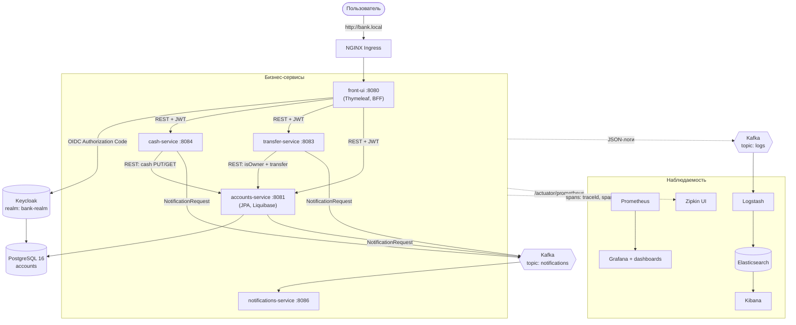
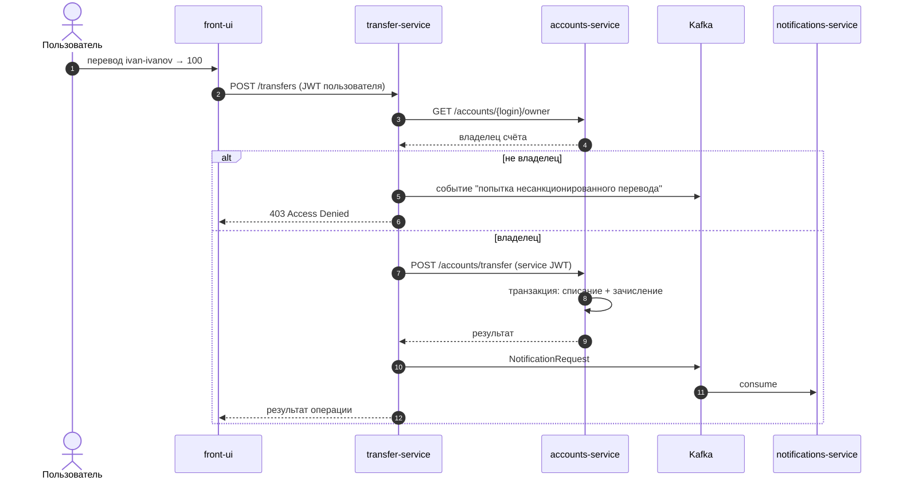

# 🏦 Bank App — микросервисное банковское приложение на Kubernetes

[](https://adoptium.net/)
[](https://spring.io/projects/spring-boot)
[](https://gradle.org/)
[](https://kafka.apache.org/)
[](https://kubernetes.io/)
[](https://www.keycloak.org/)
[](#-тестирование)

Учебный проект курса **«Java Middle Разработчик» (Яндекс Практикум)**: микросервисная платформа розничного банкинга — счета, пополнение/снятие, переводы между клиентами, события-уведомления — с production-подходом к безопасности, наблюдаемости и развёртыванию (Kubernetes + Helm).

> **Что демонстрирует проект:** contract-first API на OpenAPI, событийную интеграцию через Kafka, OAuth2/OIDC авторизацию (Keycloak), полную наблюдаемость (метрики Prometheus + Grafana, трейсинг Zipkin, логи EKL), consumer-driven contracts, интеграционные тесты на Testcontainers и упаковку в зонтичный Helm-чарт.

---

## 📋 Описание

Пользователь через веб-интерфейс (`front-ui`) входит по OIDC, видит свой счёт и счета других клиентов, может пополнить/снять средства и перевести деньги другому клиенту. Бизнес-операции выполняются отдельными сервисами, каждый шаг сопровождается событием в Kafka, из которого формируется уведомление.

Бизнес-возможности:

- 🔐 вход через Keycloak (OIDC, Authorization Code Flow)
- 👤 автосоздание и редактирование профиля счёта при первом входе
- 💰 пополнение и снятие средств (`cash-service`)
- 💸 переводы между клиентами с проверкой владельца счёта (`transfer-service`)
- 🔔 события-уведомления обо всех операциях (`notifications-service`, Kafka)
- 🛡️ операции доступны только с ролями `TRANSFER_WRITE` / `CASH_WRITE`

---

## 🏗️ Архитектура

7 Gradle-модулей: 5 Spring Boot приложений + 2 общие библиотеки.



### Синхронный сценарий: перевод денег



### Сервисы

| Модуль | Роль | Ключевое |
|---|---|---|
| `api-contract` | Общий контракт API | OpenAPI 3 спека + codegen: интерфейсы и модели генерируются, а не пишутся руками |
| `shared-kafka` | Общая шина событий | `NotificationProducer`: асинхронная отправка, метрики, логирование результата |
| `accounts-service` | Ядро домена «счёт» | PostgreSQL + Liquibase, транзакционные списания/зачисления, автосоздание профиля из JWT |
| `cash-service` | Пополнение / снятие | Валидация, вызов accounts-service, бизнес-метрики |
| `transfer-service` | Переводы между клиентами | Проверка владельца счёта, защита от несанкционированного перевода |
| `notifications-service` | Уведомления | Kafka Consumer группы `notifications` |
| `front-ui` | BFF + UI | Thymeleaf, OAuth2 login, проксирует токен пользователя в REST-сервисы |

### Общие архитектурные решения

- **Service Discovery** — средствами Kubernetes (Service + DNS: `http://accounts:8081`), без Eureka/Consul
- **Конфигурация** — ConfigMaps + Secrets Kubernetes, без Spring Cloud Config
- **Коммуникация**: синхронная — REST (WebClient) + client_credentials между сервисами; асинхронная — Kafka для событий
- **Единая точка входа** — NGINX Ingress (`bank.local`, `grafana.local`, `kibana.local`, `zipkin.local`, `kafka-ui.local`)

---

## 🛠️ Технологический стек и почему

| Технология | Зачем выбрана |
|---|---|
| **Java 21** | LTS-релиз, records, pattern matching для парсинга JWT claims |
| **Spring Boot 3.5 / WebFlux** | `WebClient` для HTTP-вызовов между сервисами; MVC для REST-эндпоинтов |
| **Spring Security + OAuth2/OIDC** | Resource Server (JWT) в сервисах + client_credentials для service-to-service — стандарт индустрии вместо самописной авторизации |
| **Keycloak** | Готовый IdP: realm, клиенты и роли импортируются JSON-файлом — «как в проде» |
| **Apache Kafka** | Асинхронная развязка: операция не зависит от доступности нотификаций; заодно транспорт для логов |
| **PostgreSQL 16 + Liquibase** | ACID для балансов + версионируемые миграции схемы |
| **Testcontainers** | Интеграционные тесты против реальных PostgreSQL/Kafka, а не моков |
| **Spring Cloud Contract** | Consumer-driven contracts: поставщик не сломает контракт API |
| **Micrometer + Prometheus + Grafana** | Метрики из коробки + кастомные бизнес-метрики (`business_*_failed_total`), дашборды в Helm |
| **Micrometer Tracing + Zipkin** | сквозной `traceId` по всем сервисам через Kafka и REST |
| **EKL (Elasticsearch + Logstash + Kibana)** | Централизованные структурированные JSON-логи, маскирование чувствительных полей в Logstash |
| **Kubernetes + Helm** | Зонтичный чарт на 12+ сабчартов: всё приложение поднимается одной командой |
| **Lombok** | Меньше бойлерплейта |

---

## 🚀 Быстрый старт

### Вариант A — Kubernetes + Helm (основной)

Требования: JDK 21, Docker, Kubernetes (minikube / kind / Rancher Desktop), kubectl, Helm 3.

```bash
# 1. Собрать и протестировать
./gradlew clean build

# 2. Собрать образы (Buildpacks)
./gradlew :accounts-service:bootBuildImage :cash-service:bootBuildImage \
          :transfer-service:bootBuildImage :notifications-service:bootBuildImage :front-ui:bootBuildImage

# 3. Загрузить образы в локальный кластер (пример для minikube)
minikube image load docker.io/yandex/workshop/accounts-service:0.0.1-SNAPSHOT
minikube image load docker.io/yandex/workshop/cash-service:0.0.1-SNAPSHOT
minikube image load docker.io/yandex/workshop/transfer-service:0.0.1-SNAPSHOT
minikube image load docker.io/yandex/workshop/notifications-service:0.0.1-SNAPSHOT
minikube image load docker.io/yandex/workshop/front-ui:0.0.1-SNAPSHOT
# имена должны совпадать с helm/bank-app/values.yaml (repository/tag) — при необходимости docker tag

# 4. Развернуть всё приложение (сервисы, БД, Kafka, Keycloak, мониторинг)
helm install bank-app ./helm/bank-app -n bank --create-namespace

# 5. Пробросить ingress (minikube)
minikube addons enable ingress
echo "$(minikube ip) bank.local grafana.local kibana.local zipkin.local kafka-ui.local" | sudo tee -a /etc/hosts

# 6. Проверить готовность и прогнать Helm-тесты
kubectl get pods -n bank -w
helm test bank-app -n bank
```

Приложение: **http://bank.local**

Тестовый пользователь: `test-user` / `test123` (креды — в `helm/bank-app/keycloak/bank-realm.json`; там же `ivan-ivanov` — для проверки переводов между клиентами). Администратор Keycloak: `admin`/`admin`.

<details>
<summary><b>Вариант B — локальная разработка без кластера</b></summary>

Инфраструктура (Keycloak, Kafka, мониторинг, EKL) поднимается по-отдельности из `docker/`:

```bash
docker compose -f docker/keycloak/docker-compose.yml up -d   # Keycloak :8085 + realm
docker compose -f docker/kafka/docker-compose.yml up -d      # Kafka :9092 + Kafka UI
docker compose -f docker/monitoring/docker-compose.yml up -d # Prometheus :9090 + Grafana :3000
docker compose -f docker/ekl/docker-compose.yml up -d        # EKL-стек
```

Сервисы запускаются из IDE: класс `*Application` в каждом модуле (порты — в `application.yaml`, все значения переопределяются переменными окружения).

</details>

---

## 📚 API

Контракт-first: спецификация **`api-contract/openapi/merged.yaml`** — источник правды. По ней кодогенератором (`org.openapi.generator`) создаются Java-интерфейсы и модели (`yandex.workshop.api.*`), которые сервисы реализуют. Изменение контракта = изменение кода, а не наоборот.

| Сервис | Endpoint | Описание | Доступ |
|---|---|---|---|
| front-ui | `GET /`, `POST /account, /cash, /transfer` | UI-страницы | OIDC-сессия |
| accounts | `GET/POST /accounts/me` | Профиль текущего пользователя (из JWT) | `ROLE_SERVICE` |
| accounts | `GET /accounts` | Счета других клиентов | authenticated |
| accounts | `POST /accounts/cash` | Пополнение/списание (вызывается cash-service) | `ROLE_SERVICE` + `accounts.write` |
| accounts | `POST /accounts/transfer` | Перевод в одной транзакции | `ROLE_SERVICE` + `accounts.write` |
| accounts | `GET /accounts/{login}/owner` | Владелец счёта (проверка в transfer-service) | `ROLE_SERVICE` |
| transfer | `POST /transfers` | Перевод с проверкой владельца счёта | `ROLE_USER` + `transfer.write` |
| cash | `POST /cash` | Пополнение/снятие | `ROLE_USER` |
| все | `/actuator/health`, `/actuator/prometheus` | Здоровье и метрики | permitAll |

Формат события уведомления (Kafka topic `notifications`):

```json
{
  "serviceName": "transfer-service",
  "login": "test-user",
  "message": "Пользователь test-user выполнил перевод со счёта ... на сумму 100",
  "timestamp": "2026-08-16T12:00:00Z"
}
```

> 🚧 В планах — Swagger UI (springdoc-openapi) поверх существующего контракта.

---

## 🧪 Тестирование

| Уровень | Инструменты | Примеры |
|---|---|---|
| Unit | JUnit 5, Mockito, AssertJ | `TransferServiceTest`, `CashServiceTest` — бизнес-логика, проверка отправки событий |
| Integration | **Testcontainers** (реальные PostgreSQL, Kafka), Awaitility | `AccountServiceIT`, `AccountRepositoryIT`, `NotificationKafkaConsumerIT`, `NotificationKafkaProducerIT` |
| Contract | **Spring Cloud Contract** | accounts-service верифицируется по контрактам — потребители не будут сломаны |
| Web-слой | Spring Security Test | `FrontControllerTest` |
| Smoke (k8s) | Helm tests | `helm test bank-app` — доступность всех сервисов в кластере |

```bash
./gradlew test                # unit + integration (нужен Docker для Testcontainers)
./gradlew build               # + контракты и сборка
helm test bank-app -n bank    # smoke в кластере
```

---

## 📊 Мониторинг

| Компонент | URL (ingress) | Что смотреть |
|---|---|---|
| Grafana | `grafana.local` | Дашборды загружаются из Helm-чарта автоматически: JVM, HTTP, **Business Metric** — неудачные переводы, ошибки cash/notifications |
| Prometheus | — | Scraping `/actuator/prometheus`; алерты из `prometheus-rule.yml`: `ServiceDown`, `HighHttp5xx`, `NotificationSendFailed` |
| Zipkin | `zipkin.local` | Сквозные трейсы REST → Kafka (traceId/spanId пробрасываются в заголовках и сообщениях) |
| Kibana | `kibana.local` | Индекс `bank-logs-*`; JSON-логи с `traceId`/`spanId`/`service`; Logstash маскирует чувствительные поля |

Кастомные бизнес-метрики (Micrometer Counter):

```
business_transfer_failed_total{from=...,to=...}
business_cash_failed_total{login=...}
business_notification_failed_total{login=...}
```

Цепочка логов: сервисы → Kafka (`topic: logs`, logback-kafka-appender, JSON) → Logstash → Elasticsearch → Kibana.

---

## 🔐 Безопасность

- **Аутентификация пользователя** — OIDC Authorization Code через Keycloak (front-ui — OAuth2 Client)
- **Сервисы** — Spring Security Resource Server: валидация JWT по `issuer-uri` (JWKS), stateless
- **Service-to-service** — client_credentials: например, `cash-service` получает service-токен для вызова `/accounts/cash`
- **Авторизация** — методная безопасность: `@PreAuthorize("hasRole('SERVICE') && hasAuthority('accounts.write')")`; роли realm конвертируются в authorities кастомным `JwtAuthenticationConverter`
- **Бизнес-защита** — перевод только со своего счёта: `transfer-service` проверяет владельца через `GET /accounts/{login}/owner`; попытка обхода логируется как событие безопасности и отклоняется (403)
- **Секреты** — Kubernetes Secrets (пароли БД, client secrets); дефолты в `application.yaml` — только для локальной разработки

---

## 🤔 Принятые решения

| Решение | Альтернатива | Почему так |
|---|---|---|
| K8s DNS вместо Eureka/Consul | Spring Cloud Netflix-стек | Сервисы уже в Kubernetes — отдельный discovery-сервер дублировал бы инфраструктуру |
| ConfigMaps/Secrets вместо Spring Cloud Config | Config Server | Конфигурация деплоится вместе с релизом (GitOps-подход), нет лишнего runtime-сервиса |
| Kafka для уведомлений | REST-вызов notification-service | Развязка и устойчивость: недоступность уведомлений не рушит операцию; replay событий при восстановлении |
| Один PostgreSQL (отдельные БД `accounts` / `keycloak`) | БД на каждый сервис | Учебный масштаб; граница домена проведена на уровне БД — разделить можно без изменения кода |
| Contract-first (OpenAPI codegen) | Ручные DTO + Swagger-аннотации | Один источник правды для 5 сервисов; изменения контракта видны в код-ревью |
| Общий модуль `shared-kafka` | Копипаста продюсера в сервисы | DRY: метрики, логирование и error-handling отправки — в одном месте |
| Kafka как транспорт логов | Filebeat / Fluent Bit | Брокер уже есть — не тянем новый агент; JSON-структура сохраняется до Logstash |
| `block()` на WebClient | Полностью реактивный стек | MVC-модель сервиса проще читается и тестируется; асинхронность важнее в интеграциях (Kafka-продюсер — `CompletableFuture`) |

**Известные ограничения** (честно): уведомления пока только логируются consumer'ом (нет email/SMS); операции не идемпотентны на уровне API (нет ключа операции); Saga/Outbox не внедрён — консистентность обеспечивается транзакцией в accounts-service, а события отправляются после коммита.

---

## 🚧 Планы по развитию

- [ ] Swagger UI (springdoc-openapi) поверх контракта
- [ ] Resilience4j: Circuit Breaker + Retry на WebClient-вызовах
- [ ] Идемпотентность операций (Idempotency-Key) + оптимистические блокировки (`@Version`) на балансе
- [ ] Transactional Outbox вместо прямой отправки в Kafka
- [ ] Email/SMS-доставка уведомлений
- [ ] CI/CD: build + тесты + helm lint → пуш образов в registry
- [ ] OpenTelemetry (OTLP) вместо Brave/Zipkin-стека

---

## 👥 Контакты

Автор: **Анастасия Данченко** — [GitHub @nastiadanchenko](https://github.com/nastiadanchenko)

Проект выполнен в рамках курса «Java Middle Разработчик», Яндекс Практикум. Учебный проект: не использовать для реальных платежей.

---

<details>
<summary><b>📁 Структура репозитория</b></summary>

```
bank-app/
├── api-contract/            # OpenAPI-спека (merged.yaml) + генерация контракта
├── shared-kafka/            # Общий Kafka-продюсер событий (метрики, асинхронность)
├── accounts-service/        # Счета: JPA, Liquibase, транзакции
├── cash-service/            # Пополнение/снятие
├── transfer-service/        # Переводы между клиентами
├── notifications-service/   # Consumer уведомлений
├── front-ui/                # Thymeleaf UI + OAuth2 login
├── helm/
│   ├── bank-app/            # Зонтичный чарт: сервисы + postgres + kafka + keycloak
│   │                        #   + prometheus-stack (grafana) + zipkin + EKL + Kafka UI
│   └── ekl/                 # EKL-стек отдельными чартами
├── docker/                  # Compose-файлы инфраструктуры для локальной разработки
└── build.gradle             # Корневой multi-module Gradle
```

</details>
